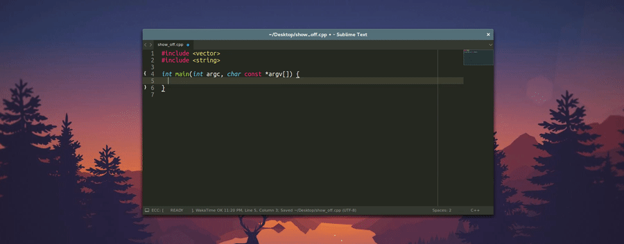

# EasyClangComplete #

Plugin for Sublime Text 3 for easy to use, out of the box autocompletions for
C-family languages.

# How to use this document #
This is a full documentation for the plugin. If you find that it cannot answer your question, do not hesitate to fire up an [issue](https://github.com/niosus/EasyClangComplete/issues).

# Simple start #

## 1. Install this plugin ##
- Best is to use [Package Control](https://packagecontrol.io/installation)
  + <kbd>CTRL</kbd>+<kbd>Shift</kbd>+<kbd>P</kbd> and install
    `EasyClangComplete`
- If you don't have Package Control (do consider installing it)
  + download one of the releases from
    [here](https://github.com/niosus/EasyClangComplete/releases) and restart Sublime Text after unpacking.

## 2. Install clang ##
- **Ubuntu**        : `sudo apt-get install clang`
- **OSX**           : ships `clang` by default. You are all set!
- **Windows**       : install the latest release from clang website.
- **Other Systems** : use your package manager or install from clang website.
- clang website: http://llvm.org/releases/download.html

## 3. Configure your includes ##
Below are a few simple cases that should be easy to set up. In case you have a
more complex setup (e.g. catkin, Qt, etc.) make sure to check out the full
[documentation](configs.md).

### Using CMake? ###
Plugin will run cmake on a proper `CMakeLists.txt` in your project folder and
will use information from it to complete your code out of the box.

### Have a compilation database? ###
Plugin will search for a compilation database `compile_commands.json` in the
project folder and will load it to complete your code. If you want to specify a custom path to a compilation database you can do it in settings, more details [here](configs.md).

### None of the above? ###
You will need a little bit of manual setup for now. Check out your options
[here](configs.md)
